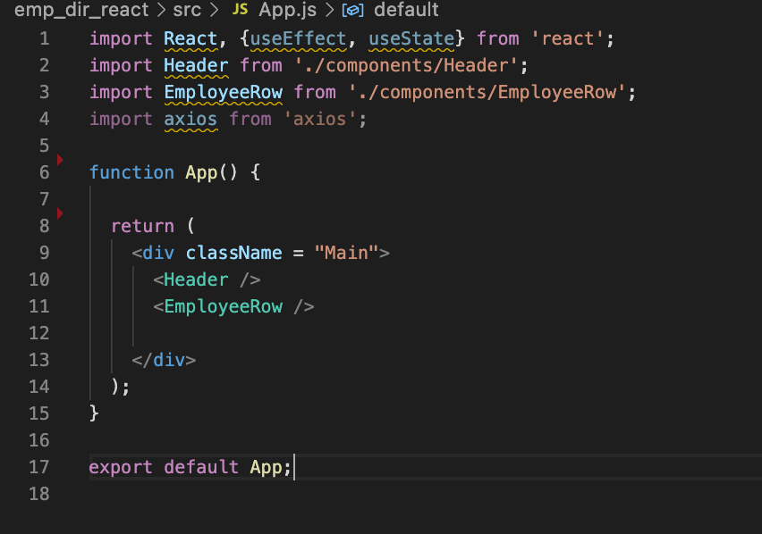
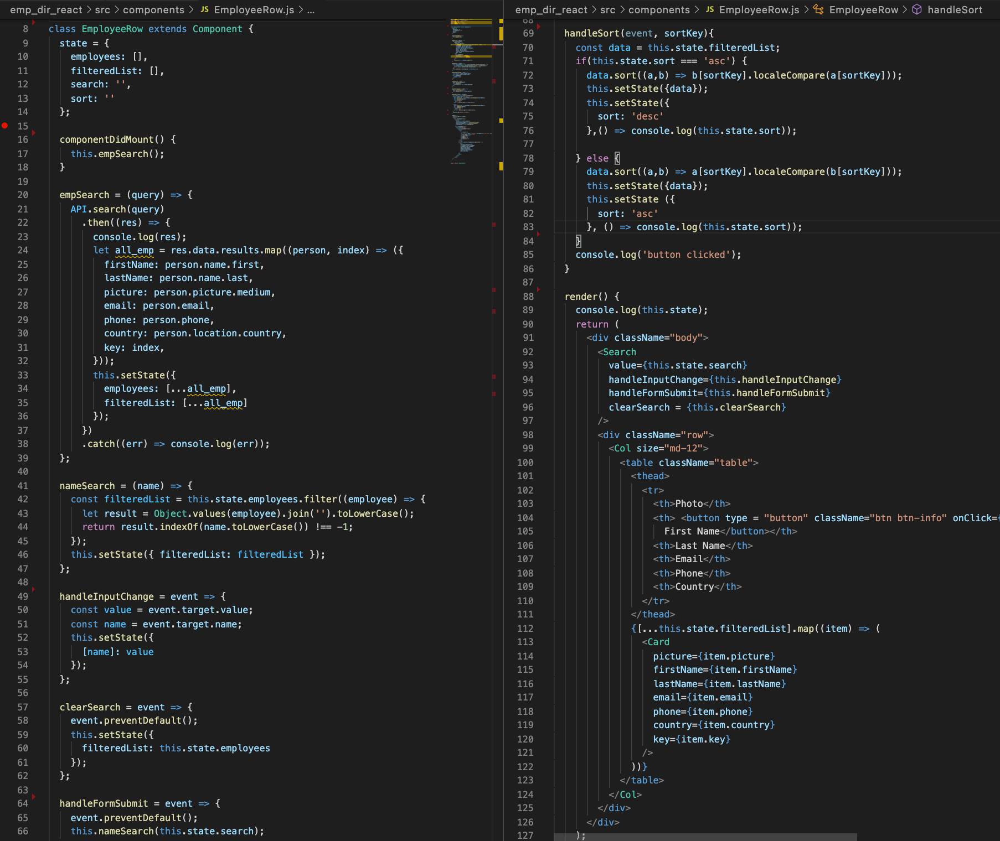
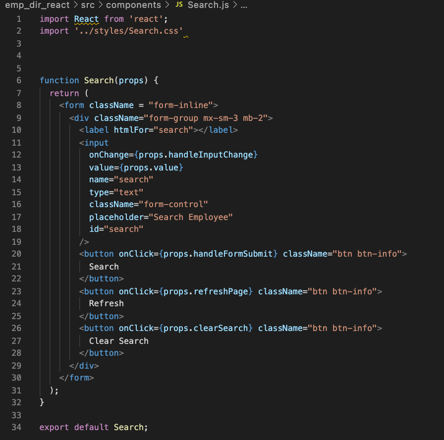
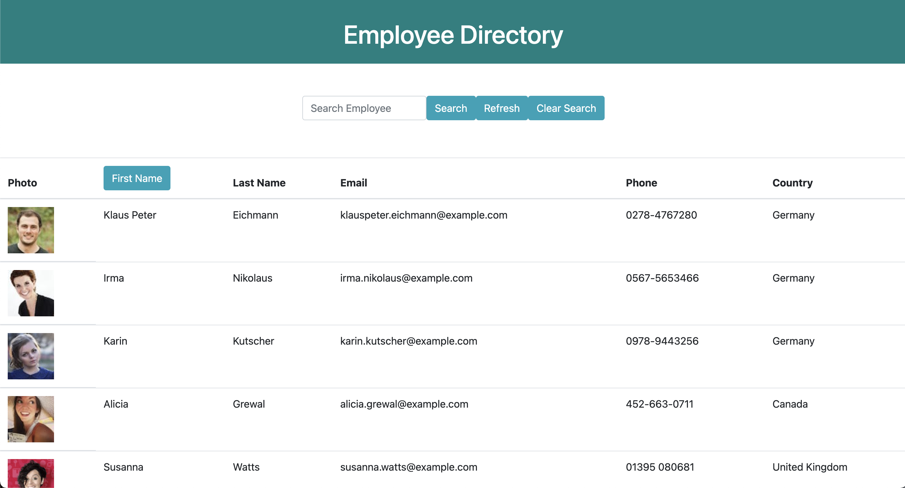
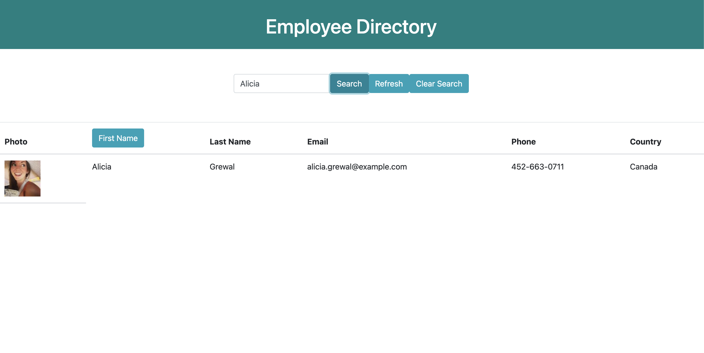
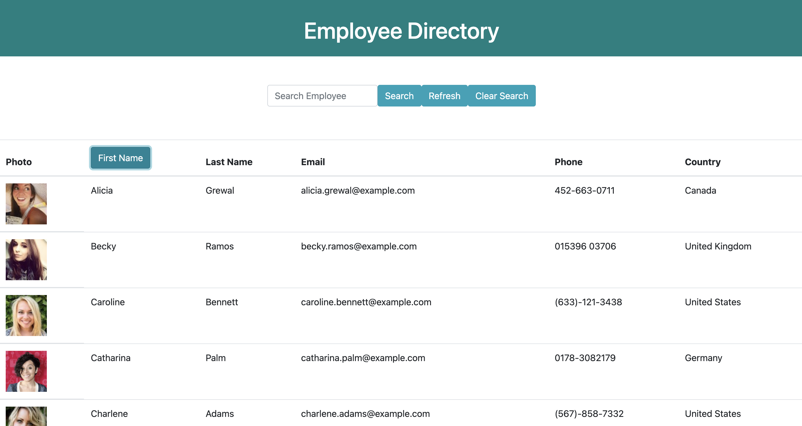
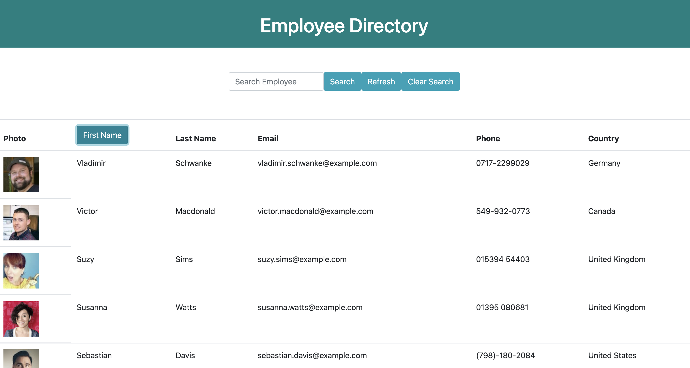

# React Employee Directory

## Table of Contents
1. [ Description ](#desc)
2. [ Task ](#task)
3. [ Link to Heroku deployment ](#link)
4. [ Structure ](#structure)
5. [ Finished product ](#final)
6. [ Contact details ](#contact)

## 1. Description
This is a React application to view the employee direactoree. The data is pulled from https://randomuser.me/
The fetched data is limited to 30 instances and nationalities US, UK, Canada, and Germany.  

## 2. Task
Task is to build React application to view the employee directory. The application also allows to search employees by name, perfrom sorting by first name in ascending and descending order. To search the employee by name, type the name in the input area, and click search button. To go back to the original list, click clear search button. To sort by name in the ascending order, click on name button. Click again to get the list of names in the descending order. To exit out of the sorted list, click refersh button.
 

## 3. Link to Heroku deployment 
The project is deployed on Heroku and available for view using this link:
https://employee-directory-react-kat.herokuapp.com/

## 4. Structure
The main functionality of this application is located in the src folder. The *index.js* and *App.js* are located in the src root, and present the high-level layout of the application. 
.
The main functionality of the application is located in the *EmployeeRow.js* and *Search.js*
.
.

## 5. Finished product
The final application looks like this:

Search result looks like this:

Viewing employees in sorted ascending order:

Viewing employees in sorted descending order:

## 6. Contact details
If you have any questions, contact me via email: 

